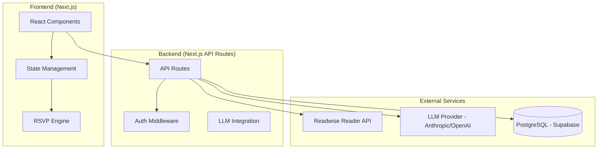

# RSVP Reader – Comprehensive Project Plan

A Spritz-style Rapid Serial Visual Presentation (RSVP) reading app with Readwise Reader integration, LLM-powered chat, and mobile-first design.

## Table of Contents

1. [Product Specification](#1-product-specification)
2. [Design and UX](#2-design-and-ux)
3. [Systems Design](#3-systems-design)
4. [Test Orientation](#4-test-orientation)
5. [Task Breakdown](#5-task-breakdown)

---

## Current Focus & Priorities

**Last Updated**: 2026-01-23

### Priority 1: React Best Practices (Immediate)

Key items from [REACT-BEST-PRACTICES-AUDIT.md](./REACT-BEST-PRACTICES-AUDIT.md):

1. Parallelize auth checks with `Promise.all()`
2. Add AbortController for fetch cancellation
3. Consider direct imports over barrel files
4. Add `next/dynamic` for heavy components

### Priority 2: DevOps Stability (~80% complete)

Remaining work in [devops/SECURITY.md](./devops/SECURITY.md):

- [ ] Database secret encryption (Severity 8.0/10)
- [ ] API rate limiting (Severity 6.0/10)

### Priority 3: RSVP Player UI Redesign

See [redesign/DESIGN_REVAMP_PLAN.md](./redesign/DESIGN_REVAMP_PLAN.md).

### Priority 4: Readwise API Integration

Complete archive sync and reading progress sync.

---

## Progress Summary

| Phase | Description          | Status                          |
| ----- | -------------------- | ------------------------------- |
| 0     | Project Setup        | Complete                        |
| 1     | Design Phase         | Complete                        |
| 2     | RSVP Engine          | Complete                        |
| 3     | Readwise Integration | ~80% (17/22 tasks)              |
| 4     | Reading Sessions     | Not Started                     |
| 5     | LLM Chat             | ~30% (UI built, backend mocked) |
| 6     | Settings & Polish    | Not Started                     |
| 7     | Final Testing        | Not Started                     |

**Test Suite**: 465+ unit tests, 9 E2E test suites

---

## 1. Product Specification

### 1.1 Vision Statement

RSVP Reader is a speed-reading web application that enables users to consume their reading backlog significantly faster by presenting words one at a time at a fixed focal point, eliminating the need for eye movement (saccades). The app integrates with Readwise Reader to pull users' saved articles and provides an LLM-powered chat feature for engaging with content.

### 1.2 Core Features

#### 1.2.1 RSVP Reading Engine

| Feature                  | Description                                                                                               | Priority |
| ------------------------ | --------------------------------------------------------------------------------------------------------- | -------- |
| **ORP Highlighting**     | Highlight the Optimal Recognition Point of each word in red, aligning that letter to a fixed center point | P0       |
| **Word-by-Word Display** | Present single words in a fixed screen location                                                           | P0       |
| **Adaptive Timing**      | Adjust display time based on word length and punctuation                                                  | P0       |
| **Speed Control**        | WPM slider (100–1000 WPM, default 300)                                                                    | P0       |
| **Playback Controls**    | Play/Pause, Rewind (word/sentence), Forward (word/sentence)                                               | P0       |
| **Progress Tracking**    | Visual progress bar + percentage/word count display                                                       | P0       |
| **Paragraph Navigation** | Jump to start of previous/next paragraph                                                                  | P1       |

#### 1.2.2 Readwise Reader Integration

| Feature                    | Description                                                       | Priority |
| -------------------------- | ----------------------------------------------------------------- | -------- |
| **OAuth/Token Connection** | Connect Reader account via access token                           | P0       |
| **Library View**           | Display saved articles from Reader Library (save-for-later items) | P0       |
| **Feed View**              | Display Feed items (RSS, email subscriptions)                     | P0       |
| **Tag Filtering**          | Filter articles by Reader tags (e.g., "dev")                      | P0       |
| **Article Sync**           | Pull article HTML content for RSVP reading                        | P0       |
| **Reading Progress Sync**  | Sync reading progress back to Reader                              | P1       |

#### 1.2.3 LLM Integration

| Feature                    | Description                                            | Priority |
| -------------------------- | ------------------------------------------------------ | -------- |
| **Article Chat**           | Chat with LLM about the current article                | P0       |
| **Multi-Provider Support** | Support Claude, GPT, Gemini via user-supplied API keys | P0       |
| **Context Injection**      | System prompt includes full article content            | P0       |
| **Chat History**           | Persist chat history per article                       | P1       |
| **Pre/Post Read Chat**     | Access chat before or after RSVP reading               | P0       |

#### 1.2.4 History and Ratings

| Feature              | Description                                                           | Priority |
| -------------------- | --------------------------------------------------------------------- | -------- |
| **Reading History**  | Track every read session (article, WPM, mode, duration, completion %) | P0       |
| **Post-Read Rating** | Prompt user to rate articles (1–5 stars) after reading                | P0       |
| **Rating Storage**   | Store ratings in backend database                                     | P0       |
| **History Browse**   | View reading history with filters                                     | P1       |

#### 1.2.5 User Interface

| Feature                     | Description                                      | Priority |
| --------------------------- | ------------------------------------------------ | -------- |
| **Minimalist RSVP Display** | Clean, distraction-free word presentation        | P0       |
| **Dark/Light Mode**         | Theme toggle with system preference detection    | P0       |
| **Font Customization**      | Adjustable font size, family, and color          | P1       |
| **Mobile-First Design**     | Responsive layout optimized for mobile           | P0       |
| **Desktop Support**         | Fully functional on desktop browsers             | P0       |
| **RTL Support**             | Proper rendering of Hebrew and other RTL content | P0       |

### 1.3 User Stories

```
As a reader, I want to connect my Readwise Reader account so I can access my saved articles.

As a reader, I want to see my Library and Feed items separately so I can choose what to read.

As a reader, I want to filter articles by tags so I can focus on specific topics like "dev".

As a reader, I want to read articles in RSVP mode so I can read faster without eye strain.

As a reader, I want to control reading speed (WPM) so I can find my comfortable pace.

As a reader, I want to pause/resume reading so I can take breaks without losing my place.

As a reader, I want to rewind or skip forward so I can re-read or skip content.

As a reader, I want to chat with an AI about the article so I can deepen my understanding.

As a reader, I want to rate articles after reading so I can track quality over time.

As a reader, I want to use the app on my phone so I can read on the go.

As a Hebrew reader, I want RTL content to display correctly so I can read articles in Hebrew.
```

### 1.4 ORP Algorithm Design

Based on analysis of [OpenSpritz](file:///research/openspritz), [speedread](file:///research/speedread), and Spritz research:

**Optimal Recognition Point Calculation:**

```javascript
function calculateORP(wordLength) {
  // Based on speedread's lookup table approach
  if (wordLength > 13) return 4;
  const orpTable = [0, 0, 1, 1, 1, 1, 2, 2, 2, 2, 3, 3, 3, 3];
  return orpTable[wordLength] || 0;
}
```

**Timing Algorithm:**

| Condition                           | Time Multiplier          |
| ----------------------------------- | ------------------------ |
| Base word time                      | 60000 / WPM (ms)         |
| Sentence-ending punctuation (. ! ?) | 3x base                  |
| Clause punctuation (, : ;)          | 2x base                  |
| Long words (>8 chars)               | 1.5x base                |
| Word length factor                  | +√(length) × 0.04 × base |

**Display Alignment:**

- Words are padded/aligned so the ORP character is always at the fixed center point
- Left portion displayed before center, right portion after
- ORP character highlighted in red/accent color

---

## 2. Design and UX

### 2.1 Design Philosophy

- **Mobile-First**: Every screen designed for touch interaction on small screens first
- **Minimalism**: Focus on content, remove all unnecessary UI elements
- **Speed**: Fast interactions, instant feedback, smooth animations
- **Accessibility**: High contrast, adjustable fonts, RTL support

### 2.2 Screen Inventory

#### Screen 1: Onboarding / Connect Reader

- Single-purpose screen to input Readwise access token
- Link to "Get your token" page
- "Connect" CTA button
- Error handling for invalid tokens

#### Screen 2: Library (Home)

- Tab bar: Library | Feed | History
- Article cards with: title, author, site, reading time, tags
- Pull-to-refresh
- Tag filter chips at top
- Floating action button or tap-to-read

#### Screen 3: Article Detail / Reader View

- Full article display (optional traditional read mode)
- "Start RSVP" prominent CTA
- Article metadata header
- LLM Chat floating button
- Settings gear icon

#### Screen 4: RSVP Reading Mode

- **Center focus zone**: Large word display with ORP highlighting
- **Minimal chrome**: Only essential controls visible
- **Bottom bar**: Progress indicator, current WPM
- **On-screen controls**: Play/Pause button, Rewind/Forward buttons, WPM slider

#### Screen 5: Article Chat (LLM)

- Chat interface with message bubbles
- System context (article) hidden but active
- Suggested prompts: "Summarize this", "Key takeaways", "Explain X"
- Input field with send button

#### Screen 6: Post-Read Rating

- Modal/overlay after article completion
- 5-star rating UI
- Optional comment field
- "Skip" and "Submit" buttons

#### Screen 7: Reading History

- Chronological list of read articles
- Each entry: title, date, WPM used, completion %, rating
- Filter by date range, rating

#### Screen 8: Settings

- Theme toggle (dark/light/system)
- Default WPM setting
- Font size and family
- Reader token management
- LLM API key management

### 2.3 Design Tokens (Proposed)

```css
/* Colors - Dark Mode (Primary) */
--bg-primary: #0a0a0b;
--bg-secondary: #141416;
--bg-elevated: #1c1c1f;
--text-primary: #ffffff;
--text-secondary: #a1a1aa;
--accent-primary: #ef4444; /* ORP highlight red */
--accent-secondary: #3b82f6; /* Interactive blue */
--success: #22c55e;
--warning: #f59e0b;

/* Colors - Light Mode */
--bg-primary-light: #ffffff;
--bg-secondary-light: #f4f4f5;
--text-primary-light: #18181b;
--text-secondary-light: #71717a;

/* Typography */
--font-reading: 'Inter', -apple-system, sans-serif;
--font-mono: 'JetBrains Mono', monospace;
--font-size-rsvp: clamp(1.5rem, 6vw, 3rem);
--font-size-body: 1rem;
--font-size-small: 0.875rem;

/* Spacing */
--space-xs: 0.25rem;
--space-sm: 0.5rem;
--space-md: 1rem;
--space-lg: 1.5rem;
--space-xl: 2rem;

/* Animations */
--transition-fast: 150ms ease;
--transition-normal: 250ms ease;
```

### 2.4 Wireframes

The Design Phase produced interactive HTML/CSS/JS prototypes for:

1. **Mobile Library View** – Article list with tabs and filters
2. **Mobile RSVP View** – Core reading experience with ORP
3. **Mobile Chat View** – LLM conversation interface
4. **Desktop Library View** – Wider layout with sidebar
5. **Desktop RSVP View** – Centered focus with ambient controls

### 2.5 Interaction Patterns

**RSVP Controls (On-Screen Buttons)**

- **Play/Pause Button**: Center, prominently displayed
- **Rewind Button**: Skip back one word or sentence
- **Forward Button**: Skip forward one word or sentence
- **WPM Slider**: Visible speed control
- **Settings Menu**: Gear icon for additional options
- **Exit Button**: Close RSVP mode and return to article

**RSVP Controls (Keyboard - Desktop)**

- **Space**: Pause/Resume
- **Left Arrow**: Rewind one word
- **Right Arrow**: Forward one word
- **Up Arrow**: Increase WPM
- **Down Arrow**: Decrease WPM
- **Escape**: Exit RSVP mode

---

## 3. Systems Design

### 3.1 Architecture Overview



### 3.2 Technology Stack

| Layer         | Choice                             | Rationale                                       |
| ------------- | ---------------------------------- | ----------------------------------------------- |
| **Framework** | Next.js 14+ (App Router)           | Full-stack React, API routes, SSR/SSG, great DX |
| **Language**  | TypeScript                         | Type safety for complex state management        |
| **Styling**   | Vanilla CSS + CSS Modules          | Maximum control, no build dependencies          |
| **Database**  | Supabase (PostgreSQL)              | Managed Postgres, auth, real-time, free tier    |
| **Hosting**   | Vercel                             | Zero-config Next.js deployment, edge functions  |
| **LLM**       | Multi-provider (Claude/GPT/Gemini) | User supplies their own API keys                |
| **Auth**      | Supabase Auth (email/password)     | Simple auth for fast testing + Reader token     |

### 3.3 Database Schema

```sql
-- Users table (extends Supabase auth.users)
CREATE TABLE users (
  id UUID PRIMARY KEY REFERENCES auth.users(id),
  email TEXT NOT NULL,
  reader_access_token TEXT,  -- Encrypted Readwise token
  llm_provider TEXT,         -- 'anthropic', 'openai', 'google'
  llm_api_key TEXT,          -- User's API key (encrypted)
  default_wpm INTEGER DEFAULT 300,
  theme TEXT DEFAULT 'system',
  font_size TEXT DEFAULT 'medium',
  created_at TIMESTAMPTZ DEFAULT NOW(),
  updated_at TIMESTAMPTZ DEFAULT NOW()
);

-- Reading sessions
CREATE TABLE reading_sessions (
  id UUID PRIMARY KEY DEFAULT gen_random_uuid(),
  user_id UUID REFERENCES users(id) ON DELETE CASCADE,
  reader_document_id TEXT NOT NULL,  -- Readwise document ID
  article_title TEXT NOT NULL,
  article_url TEXT,
  started_at TIMESTAMPTZ DEFAULT NOW(),
  ended_at TIMESTAMPTZ,
  wpm_start INTEGER NOT NULL,
  wpm_end INTEGER,
  words_read INTEGER DEFAULT 0,
  total_words INTEGER NOT NULL,
  completion_percentage DECIMAL(5,2) DEFAULT 0,
  mode TEXT DEFAULT 'rsvp',  -- 'rsvp' or 'traditional'
  rating INTEGER,  -- 1-5 stars
  created_at TIMESTAMPTZ DEFAULT NOW()
);

-- Chat conversations
CREATE TABLE chat_conversations (
  id UUID PRIMARY KEY DEFAULT gen_random_uuid(),
  user_id UUID REFERENCES users(id) ON DELETE CASCADE,
  reader_document_id TEXT NOT NULL,
  article_title TEXT NOT NULL,
  created_at TIMESTAMPTZ DEFAULT NOW(),
  updated_at TIMESTAMPTZ DEFAULT NOW()
);

-- Chat messages
CREATE TABLE chat_messages (
  id UUID PRIMARY KEY DEFAULT gen_random_uuid(),
  conversation_id UUID REFERENCES chat_conversations(id) ON DELETE CASCADE,
  role TEXT NOT NULL,  -- 'user' or 'assistant'
  content TEXT NOT NULL,
  created_at TIMESTAMPTZ DEFAULT NOW()
);

-- Cached articles (to reduce Reader API calls)
CREATE TABLE cached_articles (
  id UUID PRIMARY KEY DEFAULT gen_random_uuid(),
  user_id UUID REFERENCES users(id) ON DELETE CASCADE,
  reader_document_id TEXT NOT NULL,
  html_content TEXT,
  plain_text TEXT,
  word_count INTEGER,
  cached_at TIMESTAMPTZ DEFAULT NOW(),
  UNIQUE(user_id, reader_document_id)
);

-- Indexes
CREATE INDEX idx_reading_sessions_user ON reading_sessions(user_id);
CREATE INDEX idx_reading_sessions_document ON reading_sessions(reader_document_id);
CREATE INDEX idx_chat_conversations_user_doc ON chat_conversations(user_id, reader_document_id);
CREATE INDEX idx_cached_articles_user_doc ON cached_articles(user_id, reader_document_id);
```

### 3.4 API Design

#### Internal API Routes (Next.js)

| Endpoint                         | Method    | Description                           |
| -------------------------------- | --------- | ------------------------------------- |
| `/api/auth/connect-reader`       | POST      | Validate and store Reader token       |
| `/api/reader/documents`          | GET       | Fetch user's documents (with caching) |
| `/api/reader/documents/[id]`     | GET       | Get single document with HTML content |
| `/api/reader/tags`               | GET       | Fetch user's tags                     |
| `/api/sessions`                  | GET/POST  | CRUD for reading sessions             |
| `/api/sessions/[id]/complete`    | POST      | Mark session complete, trigger rating |
| `/api/chat/[documentId]`         | GET       | Get chat history for document         |
| `/api/chat/[documentId]/message` | POST      | Send message and get LLM response     |
| `/api/settings`                  | GET/PATCH | User settings                         |

#### Readwise Reader API Integration

```typescript
// Reader API wrapper
interface ReaderDocument {
  id: string;
  url: string;
  source_url: string;
  title: string;
  author: string;
  category: 'article' | 'email' | 'rss' | 'pdf' | 'epub' | 'tweet' | 'video';
  location: 'new' | 'later' | 'archive' | 'feed';
  tags: Record<string, string>;
  word_count: number;
  reading_progress: number;
  summary: string;
  image_url: string;
  published_date: string;
}

// Fetch with pagination
async function fetchDocuments(
  token: string,
  location?: string,
  tag?: string
): Promise<ReaderDocument[]>;

// Fetch with HTML content
async function fetchDocumentContent(token: string, documentId: string): Promise<string>;
```

### 3.5 Security Considerations

| Concern                    | Mitigation                                                                 |
| -------------------------- | -------------------------------------------------------------------------- |
| **Reader Token Storage**   | Encrypt at rest using Supabase Vault or environment-based encryption       |
| **API Authentication**     | Supabase JWT for all API routes                                            |
| **LLM API Keys**           | User provides their own key OR app uses server-side key with rate limiting |
| **XSS in Article Content** | Sanitize HTML with DOMPurify before rendering                              |
| **CSRF**                   | Next.js built-in protections + SameSite cookies                            |
| **Rate Limiting**          | Implement per-user rate limiting on LLM endpoints                          |

### 3.6 DevOps and Infrastructure

**CI/CD Pipeline (GitHub Actions)**

```yaml
# .github/workflows/main.yml
name: CI/CD

on:
  push:
    branches: [main]
  pull_request:
    branches: [main]

jobs:
  test:
    runs-on: ubuntu-latest
    steps:
      - uses: actions/checkout@v4
      - uses: actions/setup-node@v4
        with: { node-version: '20' }
      - run: npm ci
      - run: npm run lint
      - run: npm run type-check
      - run: npm run test
      - run: npm run test:e2e

  deploy:
    needs: test
    if: github.ref == 'refs/heads/main'
    runs-on: ubuntu-latest
    steps:
      - uses: actions/checkout@v4
      - uses: amondnet/vercel-action@v25
        with:
          vercel-token: ${{ secrets.VERCEL_TOKEN }}
          vercel-org-id: ${{ secrets.VERCEL_ORG_ID }}
          vercel-project-id: ${{ secrets.VERCEL_PROJECT_ID }}
          vercel-args: '--prod'
```

**Monitoring**

- **Error Tracking**: Sentry
- **Analytics**: Vercel Analytics (privacy-focused)
- **Uptime**: Vercel/Supabase built-in
- **Logging**: Vercel Logs + structured JSON logging

---

## 4. Test Orientation

### 4.1 Testing Strategy

| Test Type             | Tools                          | Coverage Target                         |
| --------------------- | ------------------------------ | --------------------------------------- |
| **Unit Tests**        | Vitest + React Testing Library | 80%+ for utilities, hooks, components   |
| **Integration Tests** | Vitest + MSW (API mocking)     | All API routes                          |
| **E2E Tests**         | Playwright                     | Critical user flows on mobile + desktop |
| **Visual Regression** | Playwright screenshots         | Key UI states                           |

### 4.2 Test Categories

#### Unit Tests

- ORP calculation algorithm
- Timing calculation algorithm
- Text parsing (word tokenization)
- RTL detection
- State management (hooks)
- Utility functions

#### Integration Tests

- Reader API wrapper (mocked responses)
- Database operations (reading sessions CRUD)
- Chat message flow
- Settings persistence

#### E2E Tests (Playwright)

- **Mobile viewport (375x667)**:
  1. Connect Reader account flow
  2. Browse Library, filter by tag
  3. Open article and start RSVP
  4. Control RSVP (pause, rewind, speed change)
  5. Complete reading and submit rating
  6. Open LLM chat and send message
- **Desktop viewport (1440x900)**:
  1. Same flows with keyboard controls

### 4.3 Test Execution Plan

```bash
# Run all unit and integration tests
npm run test

# Run tests in watch mode during development
npm run test:watch

# Run E2E tests (requires dev server)
npm run test:e2e

# Run E2E tests with UI (for debugging)
npm run test:e2e:ui

# Run tests with coverage report
npm run test:coverage
```

### 4.4 Test File Structure

```
src/
├── lib/
│   ├── rsvp/
│   │   ├── orp.ts
│   │   ├── orp.test.ts           # ORP algorithm tests
│   │   ├── timing.ts
│   │   ├── timing.test.ts        # Timing algorithm tests
│   │   └── tokenizer.ts
│   │   └── tokenizer.test.ts     # Word tokenization tests
│   └── reader/
│       ├── api.ts
│       └── api.test.ts           # Reader API wrapper tests (mocked)
├── app/
│   └── api/
│       └── **/*.test.ts          # API route integration tests
tests/
├── e2e/
│   ├── connect-reader.spec.ts
│   ├── library-browse.spec.ts
│   ├── rsvp-reading.spec.ts
│   ├── llm-chat.spec.ts
│   └── rating-flow.spec.ts
└── fixtures/
    └── sample-articles.json
```

---

## 5. Task Breakdown

### Phase 0: Project Setup

- [x] **0.1** Initialize Next.js project with TypeScript
- [x] **0.2** Configure Vitest + React Testing Library
- [x] **0.3** Configure Playwright for E2E
- [x] **0.4** Set up Supabase project and database schema
- [x] **0.5** Configure ESLint, Prettier, and husky pre-commit hooks
- [x] **0.6** Set up GitHub Actions CI/CD pipeline
- [x] **0.7** Measure CI baseline time and document in this file

> **📋 Review Point**: Project scaffolding complete, CI green

### Phase 1: Design Phase (UX Prototypes)

- [x] **1.1** Create design tokens CSS file
- [x] **1.2** Build mobile Library view prototype (HTML/CSS/JS)
- [x] **1.3** Build mobile RSVP view prototype with ORP display
- [x] **1.3a** Adjust RSVP word alignment (ORP slightly left of center)
- [x] **1.4** Build mobile Chat view prototype
- [x] **1.4a** Build mobile signup/registration screen prototype
- [x] **1.4b** Build mobile login screen prototype
- [x] **1.4c** Build mobile onboarding/connect Reader screen prototype
- [x] **1.5** Build desktop layouts (Library, RSVP, Auth screens)
- [x] **1.6** Implement dark/light mode toggle
- [x] **1.7** Add RTL support for Hebrew text
- [x] **1.8** Measure CI time; optimize if >10% increase from baseline

> **📋 Review Point**: Interactive prototypes for all screens

### Phase 2: RSVP Engine (Core)

- [x] **2.1** Implement ORP calculation algorithm + unit tests
- [x] **2.2** Implement timing algorithm (punctuation, length) + unit tests
- [x] **2.3** Implement word tokenizer with RTL detection + unit tests
- [x] **2.4** Build RSVPPlayer React component (state machine)
- [x] **2.5** Add playback controls (play/pause/rewind/forward)
- [x] **2.6** Add WPM control (slider)
- [x] **2.7** Add progress tracking
- [x] **2.8** Write component tests for RSVPPlayer
- [x] **2.9** Measure CI time; optimize if >10% increase from baseline

> **📋 Review Point**: RSVP engine fully functional with tests (465+ tests passing in ~2.5s)

### Phase 3: Readwise Reader Integration

- [x] **3.1** Create Reader API wrapper + integration tests (mocked)
- [x] **3.2** Build onboarding/connect flow UI
- [x] **3.2a** Implement Supabase email/password auth (signup + login)
- [x] **3.3** Implement `/api/auth/connect-reader` endpoint
- [x] **3.4** Implement `/api/reader/documents` endpoint with caching
- [x] **3.5** Implement `/api/reader/documents/[id]` for content fetch
- [x] **3.6** Implement `/api/reader/tags` endpoint
- [x] **3.7** Build Library page with article cards
- [x] **3.8** Build Feed page (separate tab)
- [x] **3.9** Implement tag filtering
- [x] **3.10** E2E test: Connect + Browse + Filter
- [x] **3.10a** E2E test: Supabase signup flow with cleanup
- [x] **3.11** Measure CI time; optimize if >10% increase from baseline
- [x] **3.12** Refactor Library view: Switch from cards to list items for higher information density
- [x] **3.13** Add sort options to Library (e.g., sort by date added)
- [x] **3.14** Implement filter by tag for Library (server-side query + UI state)
- [x] **3.14a** Fix RSVP reader to use Readwise content instead of demo placeholder text (tests + client fetch)
- [ ] **3.15** Implement pagination or infinite scroll for Library to handle large document sets efficiently
- [x] **3.16** Design background Readwise sync worker + rate limiting plan
- [x] **3.17** Implement per-user sync state, cron worker, and cached HTML storage (see `docs/readwise-sync-plan.md`)
- [x] **3.18** Switch app reads to DB cache only + sync-on-miss behavior
- [x] **3.18a** User not seeing latest items in Library view. Debug the problem and fix it. Make sure most recent data is the first we fetch. And make sure subsequent sync operations use ongoing pagination if needed, and maximizing on possible API calls every time, in order to get User all their items as quickly as possible
- [ ] **3.18b** Make sure user has a way of filtering the library view by tapping on a filter feature and then being able to search all tags for the one to filter by
- [ ] **3.18c** Add UI option to manually trigger an account sync
- [ ] **3.19** Create archive sync plan doc (user stories, technical design, test plan) and reference it for implementation (`docs/reader-archive-sync-plan.md`)
- [ ] **3.20** Add dedicated archive sync endpoint + separate cron job to detect Reader archived state changes and persist locally (see `docs/reader-archive-sync-plan.md`)
- [ ] **3.21** Hide archived items by default in Library/Feed list views (see `docs/reader-archive-sync-plan.md`)
- [ ] **3.22** Add in-app archive action that updates Reader via API and local state (see `docs/reader-archive-sync-plan.md`)

> **📋 Review Point**: Reader integration complete with E2E tests

### Phase 4: Reading Sessions & History

- [ ] **4.1** Implement reading session creation on RSVP start
- [ ] **4.2** Implement session update (progress, WPM changes)
- [ ] **4.3** Implement session completion endpoint
- [ ] **4.4** Build post-read rating modal
- [ ] **4.5** Build reading history page
- [ ] **4.6** E2E test: Complete reading + rating flow
- [ ] **4.7** Measure CI time; optimize if >10% increase from baseline

> **📋 Review Point**: History and ratings working end-to-end

### Phase 5: LLM Chat Integration

- [ ] **5.1** Set up Anthropic Claude API integration
- [ ] **5.2** Implement `/api/chat/[documentId]/message` endpoint
- [ ] **5.3** Create system prompt template with article context
- [x] **5.4** Build chat UI component _(UI components built, backend mocked)_
- [ ] **5.5** Implement chat history persistence
- [x] **5.6** Add suggested prompts _(UI complete)_
- [ ] **5.7** E2E test: Open chat, send message, verify response
- [ ] **5.8** Measure CI time; optimize if >10% increase from baseline

> **📋 Review Point**: LLM chat functional with history

### Phase 6: Settings & Polish

- [ ] **6.1** Build settings page
- [ ] **6.2** Implement theme persistence
- [ ] **6.3** Implement default WPM persistence
- [ ] **6.4** Implement font customization
- [ ] **6.5** Add loading states and error boundaries
- [ ] **6.6** Performance optimization (code splitting, lazy loading)
- [ ] **6.7** Measure CI time; optimize if >10% increase from baseline

### Phase 7: Final Testing & Launch Prep

- [ ] **7.1** Full E2E test suite pass (mobile + desktop)
- [ ] **7.2** Cross-browser testing (Chrome, Safari, Firefox)
- [ ] **7.3** Accessibility audit (keyboard nav, screen reader)
- [ ] **7.4** Performance audit (Lighthouse)
- [ ] **7.5** Security review
- [ ] **7.6** Documentation (README, setup guide)
- [ ] **7.7** Production deployment
- [ ] **7.8** Final CI time audit and optimization

> **📋 Review Point**: App ready for production use

---

## Appendix A: User Decisions (Confirmed)

| Decision            | Choice                                                       |
| ------------------- | ------------------------------------------------------------ |
| **LLM Provider**    | Multi-provider with user-supplied keys (Claude, GPT, Gemini) |
| **Authentication**  | Email/password via Supabase Auth                             |
| **Mobile Controls** | On-screen buttons/menus, no touch gestures                   |
| **Offline Mode**    | Not needed for initial version                               |
| **Reader Sync**     | Keep reading progress separate (no sync back to Reader)      |

---

## Appendix B: CI Performance

See [devops/ci-baseline.md](./devops/ci-baseline.md) for CI performance baseline and targets.
